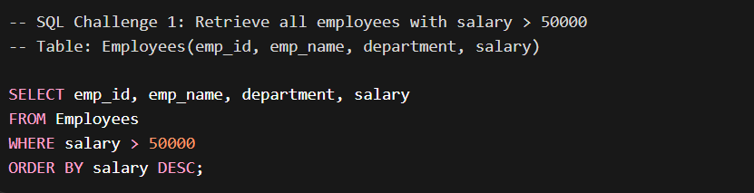

# 📊 Daily SQL Practice

Welcome to my **Daily SQL Practice Repository**.  
I solve **1 SQL problem every day** to improve my SQL skills for **Data Analyst roles**.

This repository reflects my **consistency, discipline, and continuous improvement**.

---

## 🗂 Structure
Each day contains:
- 📄 SQL Query File (.sql)
- 🖼 Output Screenshot (.png)

---

## 📅 Daily Progress

## Day 1 - 27 March 2026

### 🔹 SQL Query
[Open SQL File](SQL_001.sql)

### 🔹 Output Screenshot

---

## Day 2 - 28 March 2026

### 🔹 SQL Query
[Open SQL File](./2026-03-28/SQL_002.sql)

### 🔹 Output Screenshot

---

## Day 3 - Coming Soon

### 🔹 SQL Query
Will be uploaded

### 🔹 Output Screenshot
Will be uploaded

---

## 🚀 Goal
- Build strong SQL problem solving skills
- Maintain daily consistency
- Create strong GitHub portfolio
- Prepare for Data Analyst jobs

---

## 📈 Progress
I will update this repository daily.
Stay tuned!
